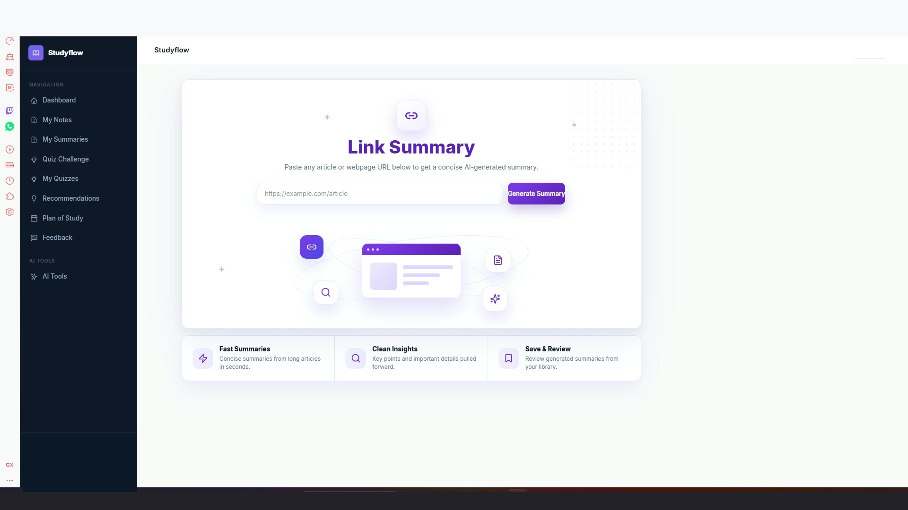

# StudyFlow – AI-Powered Learning Platform

StudyFlow is a full-stack AI-powered learning platform designed to help students study smarter and more efficiently.

The platform transforms study materials into interactive learning experiences through AI-generated summaries, quiz generation, PDF question answering, weak-topic detection, personalized recommendations, and intelligent study tools.

---

# Demo Video

🎥 Watch StudyFlow in action:

[Watch StudyFlow Demo](studyflow.mp4)

---

# Screenshots

## Landing Page


---

## Ask PDF


---

## AI Summary Result


---

## Link Summary



---

## Quiz Result


---

## Smart Recommendations


---

## Admin Dashboard


---

# Overview

StudyFlow helps students learn more effectively by combining modern web technologies with AI-powered educational tools.

Students can upload study materials, generate structured summaries, create quizzes, ask questions about PDFs, identify weak topics, and receive personalized study recommendations.

The platform also includes activity tracking, saved learning history, and administrative tools for platform management.

---

# Key Features

### Authentication & User Management

- Secure registration and login
- User profile management
- Activity tracking
- Session management

### AI Summaries

Generate structured study summaries from uploaded materials.

Features include:

- Main ideas
- Key concepts
- Important details
- Revision notes

### Link Summary

Generate summaries directly from supported online content and educational resources.

### AI Quiz Generation

Generate quizzes directly from study materials.

Supported formats:

- Multiple Choice Questions (MCQ)
- True / False
- Fill in the Blank
- Written Questions

### Ask PDF

Ask questions about uploaded documents and receive context-aware answers based on document content.

### Weak Topic Detection

Analyze quiz performance and identify learning weaknesses.

### Smart Recommendations

Provide personalized study recommendations based on:

- Quiz results
- Weak topics
- Learning activity
- User performance

### Admin Dashboard

Administrative capabilities include:

- User management
- Platform analytics
- Activity monitoring
- Content management
- Announcements
- Study plans

---

# Technology Stack

## Frontend

- React
- Vite
- Tailwind CSS
- Bootstrap

## Backend

- Laravel
- PHP
- Laravel Sanctum
- REST APIs

## Database

- MySQL

## AI Services

- Python
- FastAPI
- Ollama
- Local Large Language Models
- Retrieval-Augmented Generation (RAG)

---

# System Architecture

```text
                    Users
                      │
                      ▼
              React Frontend
                      │
                      ▼
               Laravel API
                      │
                      ▼
                MySQL Database

                      │
                      ▼
               AI Services Layer
                      │
          ┌───────────┼───────────┐
          ▼           ▼           ▼
      Summaries     Quizzes    Ask PDF
          │           │           │
          └───────────┼───────────┘
                      ▼
                FastAPI Services
                      ▼
                 Ollama Models
                      ▼
                 RAG Pipeline
```

---

# Main AI Capabilities

### AI Summary Generation

Converts uploaded study materials into structured and easy-to-review summaries.

### Quiz Generation

Creates educational quizzes from learning materials with automatic question generation.

### Ask PDF

Allows students to interact with uploaded PDFs through natural language questions.

### Recommendation Engine

Analyzes performance and recommends what to study next.

### Weak Topic Analysis

Identifies areas where students need improvement based on learning behavior and quiz performance.

---

# My Role

I developed StudyFlow as a full-stack platform, including:

- Frontend development
- Backend API development
- Database design
- Authentication system
- AI integration
- PDF processing workflows
- Quiz generation logic
- Summary generation workflows
- Recommendation system
- Activity tracking
- Admin dashboard implementation

---

# Project Status

🚀 Active Development

StudyFlow is currently being developed as a real-world educational technology platform focused on improving student learning through AI-powered tools.

---

# Contact

**Rana Hassan**  
Full-Stack Developer

📧 Email: ranaaa.hasan236@gmail.com
