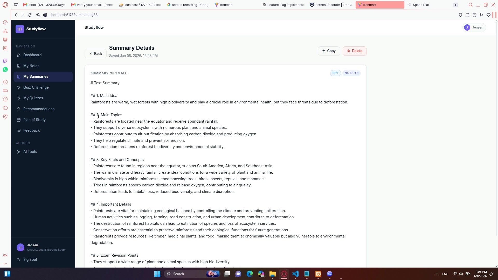
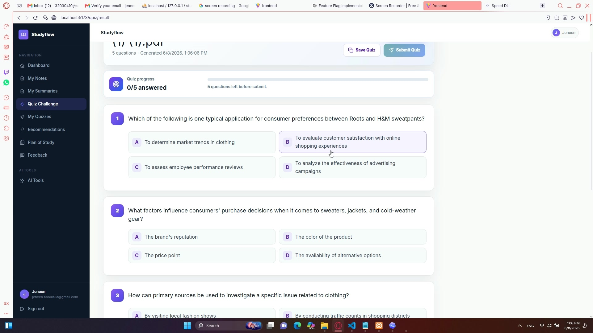
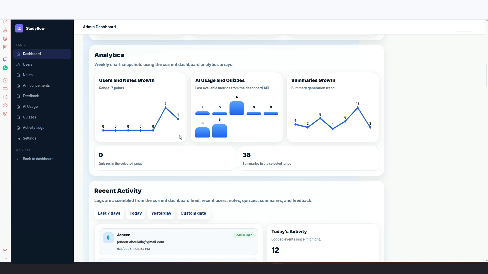

# StudyFlow – AI-Powered Learning Platform

StudyFlow is a full-stack AI-powered learning platform that helps students study smarter using AI summaries, quiz generation, PDF question answering, weak topic tracking, and personalized recommendations.

## Demo Video

[Watch StudyFlow Demo](studyflow.mp4)

## Screenshots

### Landing Page


### Ask PDF


### AI Summary Result


### Quiz Result


### Recommendations


### Admin Dashboard


## Key Features

- User authentication and secure login
- PDF/document upload
- AI-generated summaries
- AI quiz generation
- Ask PDF chat
- Weak topic recommendations
- Saved summaries and chats
- Admin dashboard
- Activity tracking

## Tech Stack

**Frontend:** React, Vite, Tailwind CSS, Bootstrap  
**Backend:** Laravel, PHP, Laravel Sanctum, REST APIs  
**Database:** MySQL  
**AI Services:** Python, FastAPI, Ollama, Local AI Models, RAG

## Architecture

```text
React Frontend
      ↓
Laravel REST API
      ↓
MySQL Database

AI Services
      ↓
FastAPI
      ↓
Ollama / Local AI Models
      ↓
PDF Processing + RAG